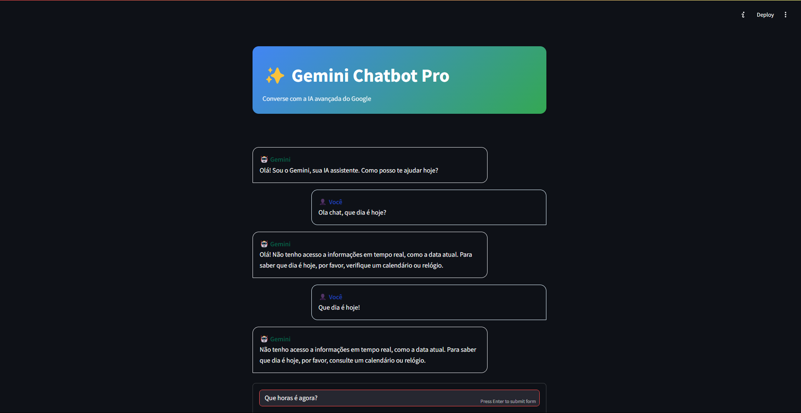

# 🤖 Gemini Chatbot

Chatbot Inteligente com IA Generativa, uma base de um sistema de conversação utilizando a API do Gemini para interações textuais em tempo real via Streamlit

## 🖼️ Projeto:


## 🚀 Funcionalidades

* 🔍 Suporte a múltiplos modelos Gemini (Flash, Pro), basta apenas alterar métodos.
* ✨ Geração de respostas contextuais e criativas

## ⚙️ Pré-requisitos

* Python 3.10+
* Conta no Google AI Studio
* Conexão com internet

## 🛠️ Instalação

1. Clone o repositório:
```bash
git clone https://github.com/yyhago/gemini-chatbot.git
cd gemini-chatbot
```

2. Crie e ative um ambiente virtual:
```bash
python -m venv venv
source venv/bin/activate  # Linux/Mac
venv\Scripts\activate    # Windows
```

3. Instale as dependências:
```bash
pip install -r requirements.txt
```

4. Crie um arquivo .env na raiz do projeto:
```bash
GEMINI_API_KEY=sua_chave_aqui
```

## 🖥️ Como Usar

1. Execute o aplicativo:
```bash
streamlit run src/main.py
```

No navegador, digite sua mensagem e interaja com a IA!

## 🧩 Estrutura do Projeto

```
gemini-chatbot/
├── src/
│   ├── main.py            # Interface principal (Streamlit)
│   └── chatbot.py         # Integração com a API Gemini
├── .env                   # Configurações sensíveis
├── requirements.txt       # Dependências
└── README.md              # Documentação
```